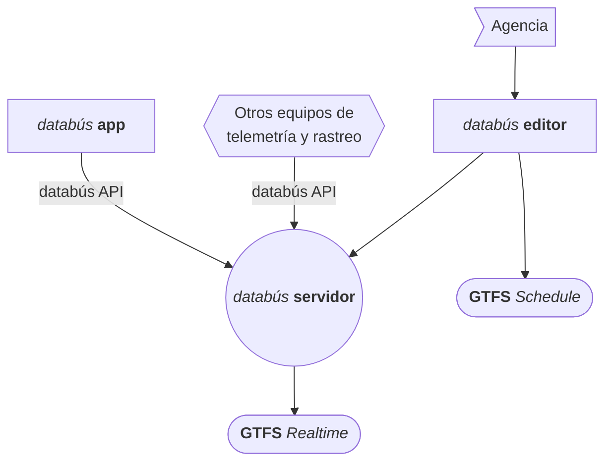

# Databús

!!! note "¿Qué es?"
    *Databús* es el subsistema de recolección y distribución de datos del servicio de transporte público, tanto la información "estática" de rutas, horarios, mapas y otros, como la información en tiempo real, utilizando varios estándares, pero principalmente GTFS.

    El conjunto de tecnologías e interfaces desarrollado permite la operación autónoma pero también en conjunto con otros proveedores y tecnologías, cumpliendo con su objetivo de interoperabilidad.

## Databús **editor** GTFS

Este es un editor web para crear suministros (*feeds*) de datos **GTFS** *Schedule*, los cuales distribuyen la información del servicio de transporte público a todas las aplicaciones de asistencia para las personas usuarias, como las aplicaciones de planificación de viajes multimodales (por ejemplo, Google Maps o Moovit) y otros medios de difusión y análisis, como sitios web, pantallas, medios impresos, y otros.

## Databús **API**

Esta es la interfaz que permite conectar a los equipos de telemetría y rastreo en los vehículos con el servidor en tiempo real. Es una interfaz universal que no condiciona cuáles equipos pueden enviar esta información. Está diseñado para contener una amplia variedad de tipos de datos relativos, por ejemplo, a la operación del vehículo y que es de interés para el operador del sistema, sin embargo, es posible utilizar solamente un subconjunto para construir el **GTFS** *Realtime* de los servicios de información para personas usuarias.

## Databús **servidor** en tiempo real

Este es un servidor que recolecta, procesa y construye el suministro **GTFS** *Realtime*, que es el complemento a **GTFS** *Schedule* para el uso del servicio.

## Databús **app** móvil operativa

Esta es una solución alternativa de bajo costo para un equipo de telemetría y rastreo con funcionalidad limitada, capaz de proveer los datos mínimos de **GTFS** *Realtime* y ofrecer información a las personas usuarias, aunque no tanto así a los operadores del servicio. Es utilizado por el conductor del vehículo.
