# Elementos del sistema de señalética

Para una comunicación unificada, esta propuesta utiliza varios **elementos** comunes a todo el sistema de información, que facilitan la identificación por parte de las personas usuarias.

A continuación hay una descripción de los [colores y tipografía](#colores-y-tipografia), el [nombre del servicio](#nombre), el [símbolo del sistema](#simbolo-del-sistema) y los [lemas](#lemas) (eslogan) que identifican la propuesta.

## Colores y tipografía

Todos los elementos están basados en la paleta de colores del [Manual de Identidad Visual](./assets/references/identidad_visual_ucr_3.1.pdf) de la Universidad de Costa Rica, revisión 3.1 del 2015.

| Nombre       | HEX     | RGB           | Muestra                        |
|--------------|---------|---------------|--------------------------------|
| Celeste UCR  | #00C0F3 | 0, 192, 243   | :material-circle:{ .celeste }  |
| Azul UCR     | #005DA4 | 0, 93, 164    | :material-circle:{ .azul }     |
| Verde UCR    | #6DC067 | 109, 192, 103 | :material-circle:{ .verde }    |
| Amarillo UCR | #FFE06A | 255, 224, 106 | :material-circle:{ .amarillo } |

La propuesta utiliza la familia tipográfica [Myriad Pro](https://es.wikipedia.org/wiki/Myriad_(tipograf%C3%ADa)), un estilo *sans serif humanista*.

## Nombre del servicio

Este servicio es comúnmente conocido como "el bus interno de la UCR". 

Un nombre especial es una forma de crear un vínculo con las personas usuarias. Aunque posiblemente "bus interno" seguirá siendo el nombre ordinario, proponemos un nombre especial, inspirados en otros casos similares como el del servicio de buses internos de la UNAM en México, llamado *PumaBus*, en alusión a su mascota. 

El nombre propuesto para el sistema es la combinación de las palabras **bus** y **UCR** en el [*port-manteau*](https://es.wikipedia.org/wiki/Acr%C3%B3nimo) *b***UCR**, estilizado como:

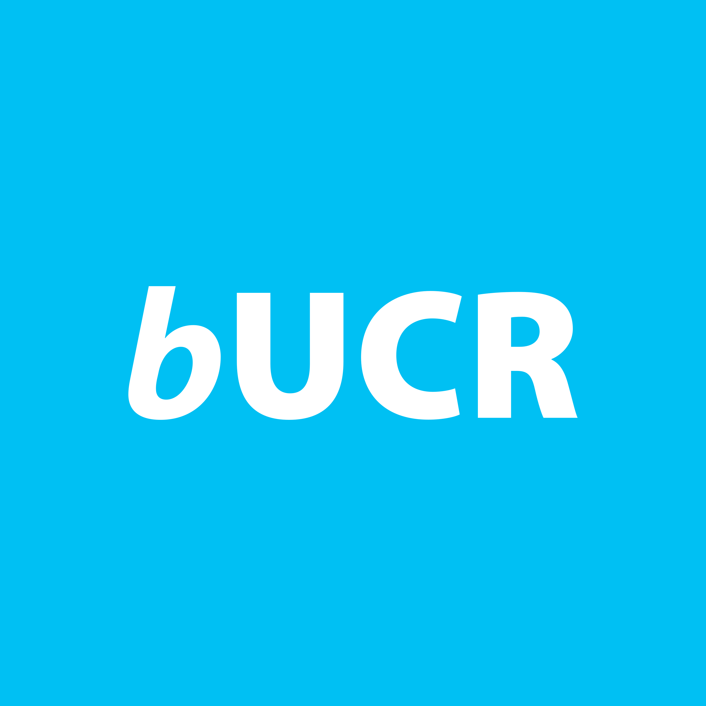

!!! info "Dónde utilizar este nombre"
    El nombre *b***UCR** puede ser utilizado en redes sociales, sitio web y otros medios, pero no es recomendado en la señalización, donde debe existir un lenguaje más neutral, ajeno a nombres arbitrarios y desconocidos para una parte de la población.

## Símbolo del sistema

La mayoría de sistemas de transporte público alrededor del mundo utiliza un símbolo para identificar el servicio en toda su comunicación y en sus vehículos, infraestructura y demás.

Existen cientos de ejemplos pero aquí presentamos cuatro como referencia.

-   **Underground (Londres)**

    

    Icónico diseño conocido como *the roundel* y creado en 1915. 

-   **MBTA (Boston)**
    
    

    El sistema es conocido como *the T*, por su símbolo.

-   **Metro de Santiago (Chile)**
    
    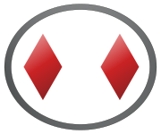

    Los rombos del símbolo representan vialidad, buses y metro.

-   **Metro de Porto (Portugal)**

    

    Diseño moderno con una *m* modificada dentro de un círculo.

Con base en estas y otras referencias, proponemos un símbolo para el servicio del bus interno de la Universidad de Costa Rica. 

### El símbolo para *el bus* es *el b*
  
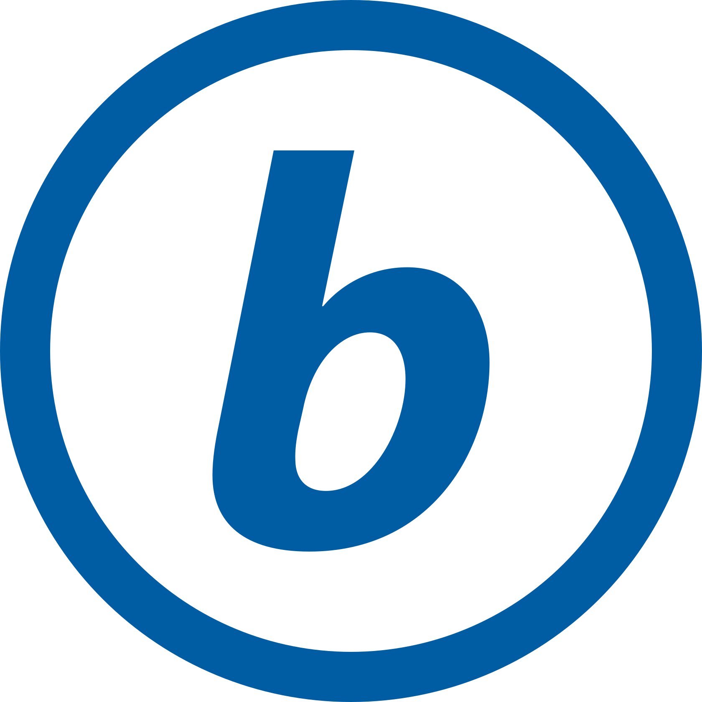

Consiste en un círculo que engloba la letra ***b***, como referencia a la palabra *bus*. Tiene las siguientes características:

- Utiliza la tipografía Myriad Pro, específicamente la letra ***b*** en negrita itálica.
- Utiliza el color Azul UCR, pero existen versiones en otros colores.

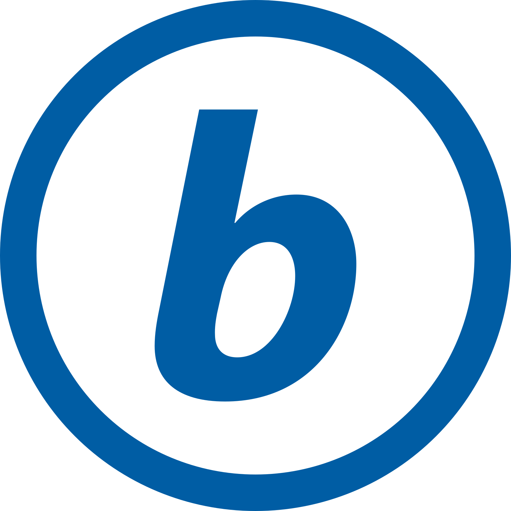

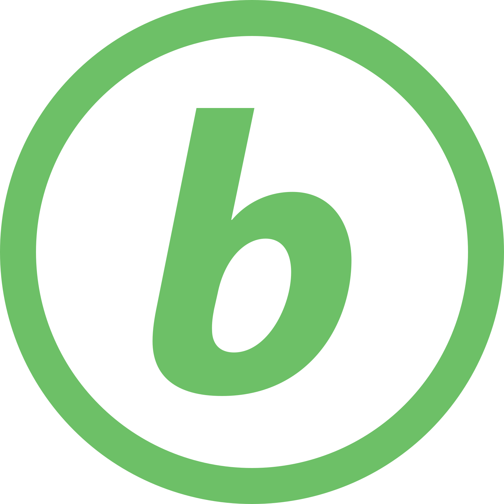
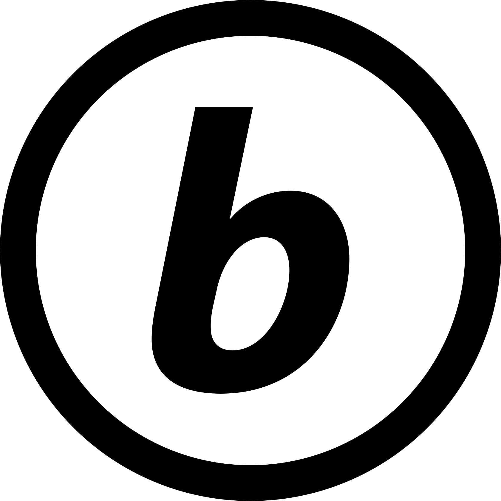

- Admite versiones con un marco cuadrado de color.

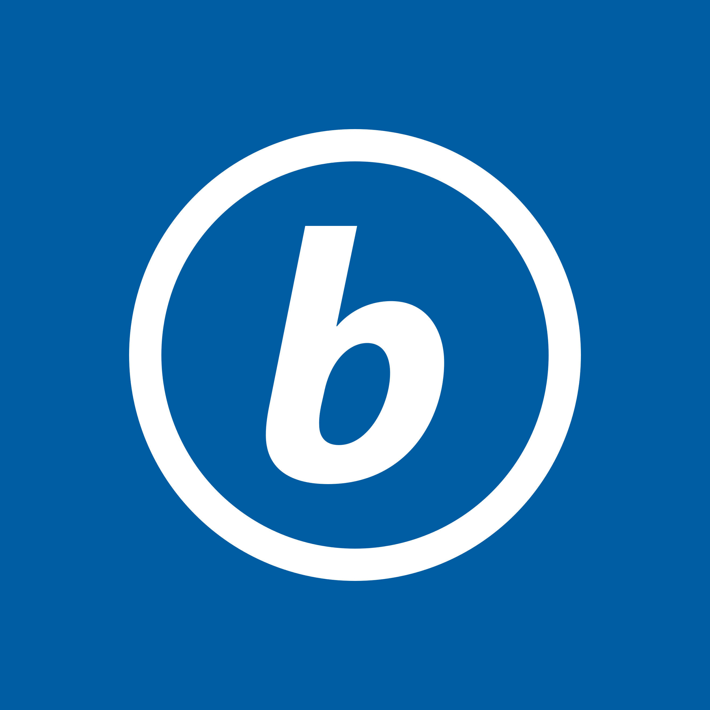
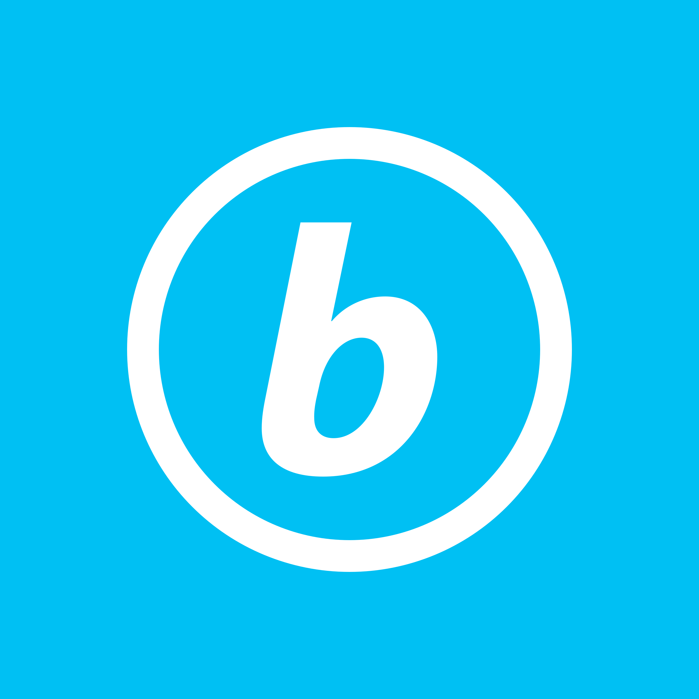
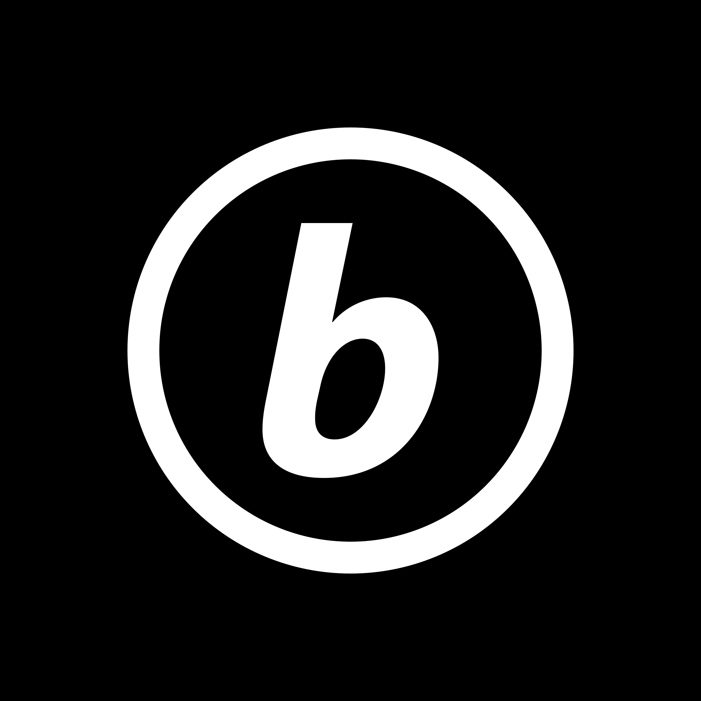

- Puede ser combinado con el nombre *b***UCR**.

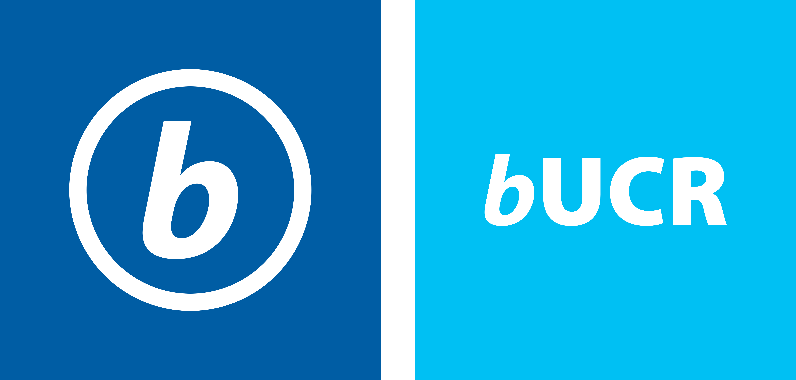

- Tiene las siguientes proporciones y área de respeto.

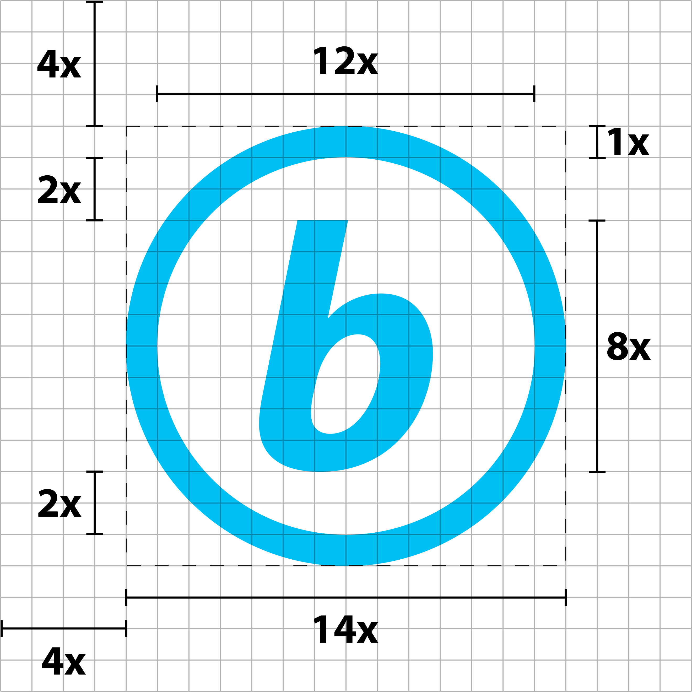

!!! note "Compatibilidad con otros elementos gráficos de la UCR"
    No utiliza la base de los logotipos de la unidades académicas u otras instancias de la UCR, pues su utilización es de naturaleza distinta. Sin embargo, mantiene conformidad con el manual de identidad visual en cuanto a colores y tipografía, respeta normas de señalización vial y sigue referencias de buenas prácticas de sistemas de transporte público alrededor del mundo. 

## Lemas

Un lema o eslogan es una "una frase corta impactante o memorable utilizada en publicidad" <small>New Oxford American Dictionary</small>.

Proponemos dos lemas.

---

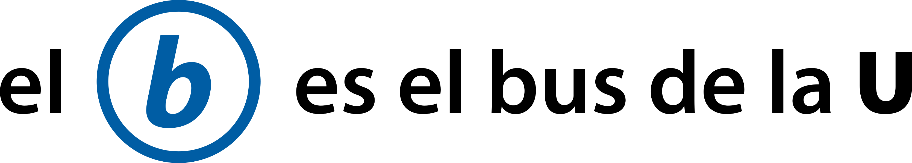

Con esta frase buscamos posicionar a **el b** como el símbolo del servicio de bus interno. Su referencia es clara y directa: "(ahora) **el** (símbolo) ***b* es** (la representación del servicio de) **el bus de la U**". Hace también un guiño a la simetría de "el b" y "la U".

---

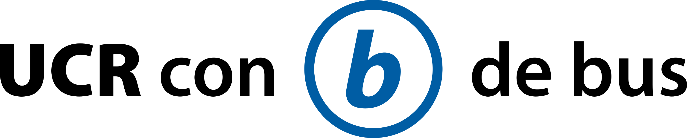

Con esta frase buscamos fomentar una asociación de la Universidad de Costa Rica con el transporte público. La UCR participa activamente con investigación, docencia y acción social en la promoción del transporte público como *motor* de desarrollo socioeconómico en el país.

Posiblemente también es una referencia cómica a la frase "con *v* de vaca o con *b* de burro", utilizada para desambiguación de la *v* y la *b* al escribir. Ahora es: *con b de bus*.
