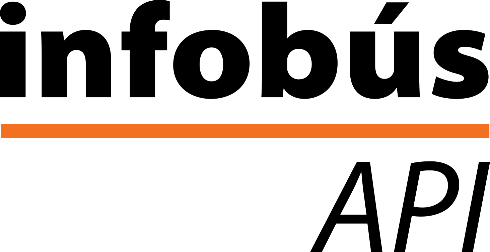
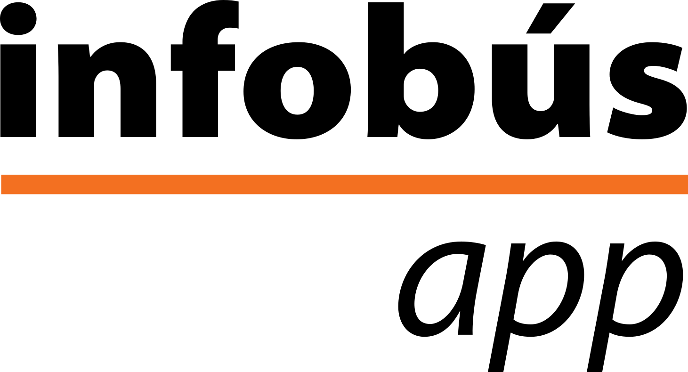

# Infobús

!!! note "¿Qué es *Infobús*?"
    *Infobús* es el subsistema de **información** del servicio para las personas usuarias del servicio de buses. Incluye múltiples medios digitales, como pantallas, sitios web y otros componentes para el uso de los datos del servicio.

*Infobús* tiene varios componentes, cuya relación está indicada en el siguiente esquema.

## Componentes

Los detalles de cada componente son los siguientes.

### :material-server: Infobús **servidor** concentrador de datos

Este es un componente centralizado para recolección, procesamiento y distribución de datos a todos los canales digitales de comunicación.

### :material-api: Infobús **API**

Esta es la interfaz de comunicación con todos los servicios conectados dentro del subsistema. Permite la obtención de datos procesados para usar en la aplicación particular, por ejemplo, los datos de ubicación de los buses para mostrar en las pantallas.

### :material-fit-to-screen: Infobús **pantallas**

Estas son pantallas con informatión en tiempo real del servicio para utilizar en paradas, estaciones o en los vehículos.

### :material-web: Infobús **web**

Este es un sitio centralizado de referencia de información para las personas usuarias del servicio. Contiene datos básicos como: información de la agencia, horarios, mapas, paradas, tarifas, días de operación y otros.

### :material-comment-quote: Infobús **comunicación**

Esta es una estrategia de comunicación con las personas usuarias del servicio, a través de distintos canales, como redes sociales, medios impresos u otros.

### :material-chart-bar: Infobús **análisis** de datos

Una plataforma para el procesamiento y análisis de datos con técnicas avanzadas y para uso de distintos actores del sistema, además de las personas usuarias, como los operadores, gestores, planificadores, reguladores, investigadores, y otros servicios interconectados.

### :material-cellphone: Infobús **app** móvil

Esta es una aplicación móvil para desplegar información a las personas usuarias sobre el servicio. Actualmente no está en desarrollo.

## Identidad visual

Esta es la propuesta para identificar cada componente:

- 

- 

- 

- 

- 

- 

- 

**Características**

- Utiliza la tipografía Myriad Pro
- Utiliza el color Naranja 3 UCR
