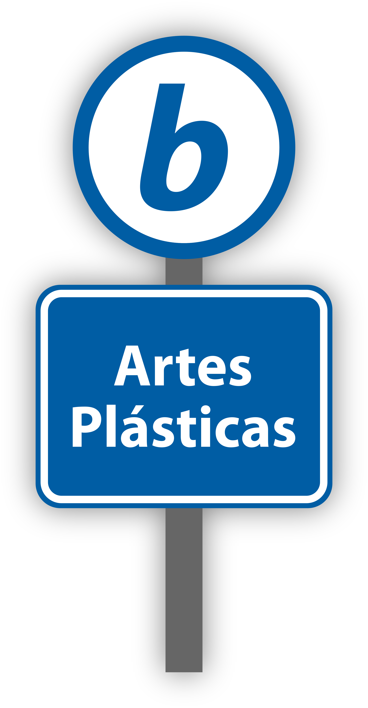
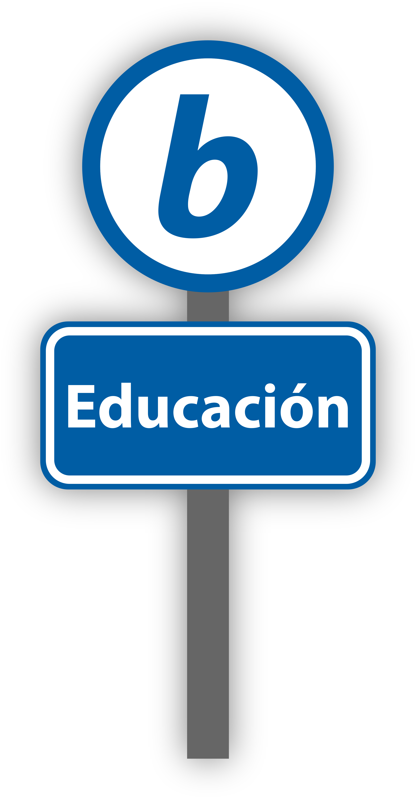
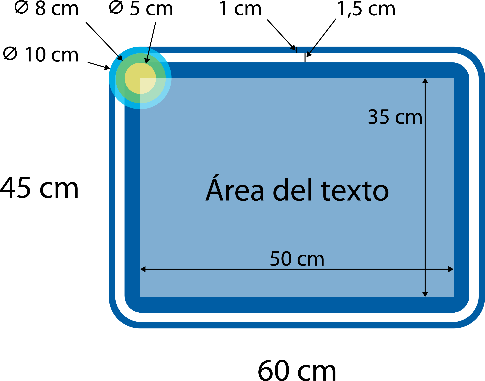
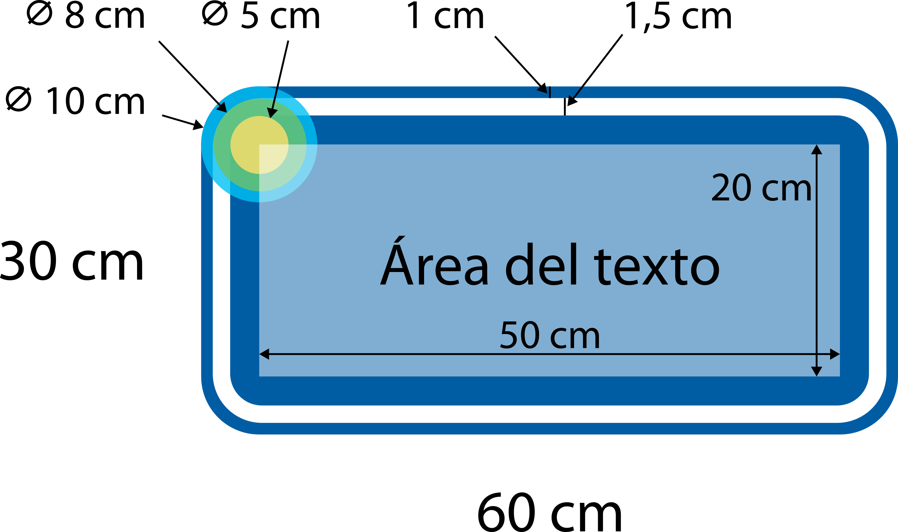

# Diseño de la rotulación de paradas de bus

Actualmente hay dos tipos de paradas en el servicio:

- **Con infraestructura**: un parabús con techo, iluminación y demás.
- **Sin infraestructura**: solamente un poste con la indicación en la acera.

Esta primera propuesta diseña una señalización para indicar **el nombre de la parada de bus**, un elemento esencial para utilizar el servicio.

En esencia, cada parada tiene dos elementos: **el *b***, como un rótulo circular, y el nombre de la parada, cuya diseño varía según el tipo de parada. Hacemos aquí la propuesta para dos tipos de rótulos:

- **Tipo cartel**: para paradas con infraestructura.
- **Tipo señal vial**: para paradas sin infraestructura.

## Nombre de la parada tipo señal vial

Está localizado en un poste en la acera. Tiene el símbolo ***b*** y el nombre de la parada.

-   **Poste con símbolo y rótulo** 
    
    Doble línea de texto

    

-   **Poste con símbolo y rótulo** 
    
    Una sola línea de texto

    

### Especificaciones

El texto es centrado verticalmente y horizontalmente.

-   **Rótulo con doble línea de texto** 
    
    

    Espacio entre líneas base es **reducido** a 1.0 líneas.

-   **Rótulo con una línea de texto** 
    
    

    Tamaño de texto recomendado menor a 550 pt, equivalente a unos 19,4 cm de alto –utilizable solamente en acrónimos cortos– y mayor a 200 pt (7 cm).

- El símbolo ***b*** tiene **45 cm de diámetro**.
- Entre el símbolo y el rótulo hay **5 cm de separación vertical** en el poste.

## Nombre de la parada tipo cartel

Está localizado en la parte trasera de la parada, con vista desde la calle. Es de gran tamaño, pues sus dimensiones pueden ser del orden de 30 cm de alto por 120 cm de ancho (pendiente de definición).

Además, cada parada tiene también el poste en la acera con el símbolo ***b***.
