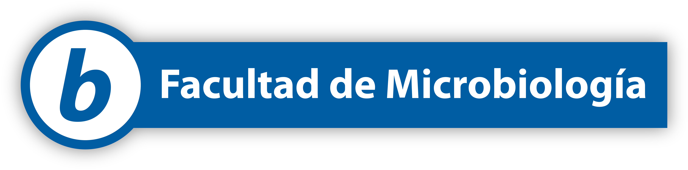

# Diseño de la rotulación de paradas de bus

Esta propuesta diseña una señalización para indicar **el nombre de la parada de bus**, un elemento esencial para utilizar el servicio. 

La falta de información en una parada (o *parabús*) es una carencia importante, según la opinión dada en el [informe de la encuesta de satisfacción](https://kerwa.ucr.ac.cr/handle/10669/91076) de las personas usuarias del servicio de bus interno y según nuestra propia evaluación con la norma [INTE W15:2007](https://erp.inteco.org/shop/inte-w15-2007-requisitos-tecnicos-para-la-construccion-de-las-paradas-de-los-vehiculos-de-transporte-publico-colectivo-1087#attr=).

La rotulación de cada parada tiene dos elementos: 

- **El símbolo *b***, como un rótulo circular.
- **El nombre de la parada**, cuyo diseño varía según el tipo.

Actualmente hay dos tipos de paradas en el servicio:

- **Con infraestructura**: un parabús con techo, iluminación, asientos y demás.
- **Sin infraestructura**: solamente un poste en la acera con la indicación de parada.

Hacemos aquí la propuesta para dos tipos de rótulos:

- **Tipo cartel horizontal**: específicamente para paradas con infraestructura.
- **Tipo señal vial vertical**: para todas las paradas, con o sin infraestructura.

!!! tip "Redundancia en la señalización"
    Los nombres de las paradas son información **relevante** para el servicio y las personas usuarias, y por tanto puede o debe ser redundante. Por ejemplo, esta propuesta sugiere ambos tipos de rótulos instalados en las paradas donde sea posible. 

## Nombre de la parada tipo señal vial

Está localizado en un poste en la acera. Tiene el símbolo ***b*** y el nombre de la parada.

-   **Poste con símbolo y rótulo** 
    
    Doble línea de texto

    

-   **Poste con símbolo y rótulo** 
    
    Una sola línea de texto

    

### Especificaciones

- El texto es centrado verticalmente y horizontalmente.
- La tipografía es Myriad Pro negrita (**bold**).
- Tamaño de texto de alrededor de 300 pt (10 cm).
- El símbolo ***b*** tiene **45 cm de diámetro**. 
- El radio de curvatura es, respectivamente: 5 cm en el marco, y del borde blanco 4 cm en el exterior y 2,5 cm en el interior.
- Entre el símbolo y el rótulo hay **5 cm de separación vertical** en el poste.

[:material-download: Descargar símbolo ***b*** en SVG](./assets/svg/b_azul.svg)

-   **Rótulo con doble línea de texto** 
    
    

    Espacio entre líneas base de texto es **reducido** a 1.0 líneas.

    [:material-download: Descargar plantilla en SVG](./assets/svg/rotulo_vertical_doble_grilla.svg)

-   **Rótulo con una línea de texto** 
    
    

    Tamaño de texto recomendado máximo de 550 pt, equivalente a unos 19,4 cm de alto (utilizable solamente en acrónimos cortos) y mínimo de 200 pt (7 cm).

    [:material-download: Descargar plantilla en SVG](./assets/svg/rotulo_vertical_simple_grilla.svg)

## Nombre de la parada tipo cartel

Este rótulo es para paradas con infraestructura y está localizado en la parte trasera, con vista desde la calle. Es de gran tamaño, pues debe ser visible para las personas en el bus tanto como para transeúntes que están buscando la parada.

### Especificaciones

- El símbolo ***b*** es idéntico al de los nombres en el poste (45 cm de diámetro). 
- La tipografía es Myriad Pro negrita (**bold**).
- Hay una sola línea de texto.
- El texto está visualmente centrado horizontalmente y verticalmente en el área de texto.
- El tamaño del texto oscila alrededor de los 400 pt (14 cm).

[:material-download: Descargar plantilla en SVG](./assets/svg/rotulo_horizontal_grilla.svg)

## Rótulo promocional (opcional)

Utilizando uno de los lemas presentados en la sección de [Elementos](./elementos.md) es posible crear un rótulo de *promoción* del servicio.

-   **Rótulo con lema** 
    
    

-   **Rótulo con ícono de bus** 
    
    

Estos rótulo pueden ser adicionados a otros rótulos informativos, sobre todo en la primera fase de implementación, para explicar de qué trata la nueva señalización.

-   **Rótulo vertical con lema** 
    
    

-   **Rótulo vertical con ícono de bus** 
    
    

### Especificaciones

[:material-download: Descargar plantilla en SVG](./assets/svg/rotulo_el_b_es_el_bus_grilla.svg)

[:material-download: Descargar plantilla en SVG](./assets/svg/rotulo_bus_grilla.svg)

## Trabajo futuro

- **Señalización de rutas**: en su operación actual, el bus tiene dos rutas: L1 y L2. Es necesario indicar cuáles de las paradas corresponden a cuál ruta. No es indispensable colocar esta señalización ahora debido a que la mayoría de paradas son para las dos rutas, y porque esta configuración de operación puede cambiar.
- **Señalización horizontal**: es posible y deseable hacer señalización horizontal, en las calles o aceras.
- **Personalización de paradas**: una propuesta de la campaña de comunicación del proyecto es motivar la "personalización" de otros elementos de diseño de la parada, para aprovechar el hecho de que son, en realidad, un abanico de las áreas de la U: educación, artes plásticas, microbiología, ingeniería, ciencias sociales, etc.