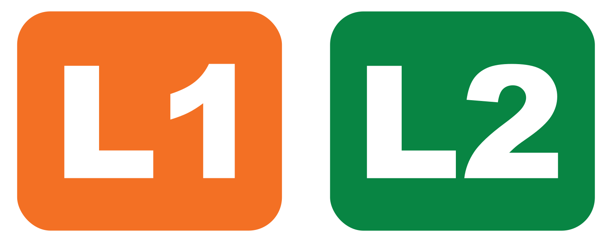

# Diseño de la rotulación de paradas de bus

Actualmente hay dos tipos de paradas del servicio:

- Con infraestructura: un parabús con techo, iluminación y demás.
- Sin infraestructura: solamente un poste en la acerca con la indicación.

Esta primera propuesta diseña una señalización para **el nombre de la parada de bus**, un elemento esencial para el servicio.

En esencia, cada parada tiene dos elementos: **el b**, como un rótulo circular, y el nombre de la parada, cuya diseño varía según el tipo de parada.

Por tanto, hacemos aquí la propuesta para dos tipos de rótulos:

- Tipo cartel: para paradas con infraestructura, localizado en la parte trasera.
- Tipo señal vial: para paradas sin infraestructura localizado en un poste.

## Nombre de la parada tipo cartel

## Nombre de la parada tipo señal vial

Para el uso del logo en las paradas se debe respetar las mismas especificaciones que se enlistan en la seccion de Señaletica, tomando en cuenta:
- Áreas de respeto correspondientes
- Colores
- Alto contraste
- Negativo

<!--hacer que cada uno de los items de la lista sea un link a la seccion correspondiente en el documento senaletica.md-->

## El ***b*** con placa de nombre

- Tamaño comparable con un ALTO. Según el [inciso 3, del artículo 27, del Sistema Costarricense de Información Jurídica (SCIJ) de la Procuraduría General de la República](https://www.pgrweb.go.cr/scij/Busqueda/Normativa/Normas/nrm_texto_completo.aspx?param1=NRTC&nValor1=1&nValor2=65539&nValor3=76620&strTipM=TC) "el ancho normal de la señal de parada deberá ser de 60 cm. como mínimo". Por lo tanto se usó esta medida como referecia y se diseñó el logo con un diámetro de 60 cm.

- Tiene placa separada debajo con el nombre de la parada. Esta placa debe ser del mismo ancho del logo de ***b***, o sea 60 cm en la mayoría de los casos. La altura de esta señal dependera de si el nombre de la parada es de una o dos líneas. En caso de ser de una línea debera ser de 30 cm de alto. En caso de ser de dos líneas debera ser de 45 cm de alto.

- El tamaño de la letra deberá estar en un rango entre 56 mm y 110 mm, en conformidad con la norma INTECO 5.1.1.2 Tamaño para la lectura visual, dando así los mejores resultados de lectura entre 2 m y 5 m de distancia del usuario al rótulo.

## Rótulo nombre de parada respaldar trasero

Elementos:

- **Logo "b"** y **Nombre de la parada**

- Opcionalmente se puede agregar el slogan del servicio. Las dos opciones por el momento son: "el ***b*** es el bus de la U" o "UCR con ***b*** de bus".

Los símbolos de rutas deben ser independientes porque no son necesariamente permanentes (puede haber cambios de nombre o colores o rutas nuevas o rutas eliminadas, etc.), por tanto, necesitamos mantener una opción que nos permita ser flexibles y hacer cambios sin tener que remplazar solo ciertos elementos de la señalética y no todos los rótulos.

- Anexo: símbolos de rutas

- Diagrama de rutas

