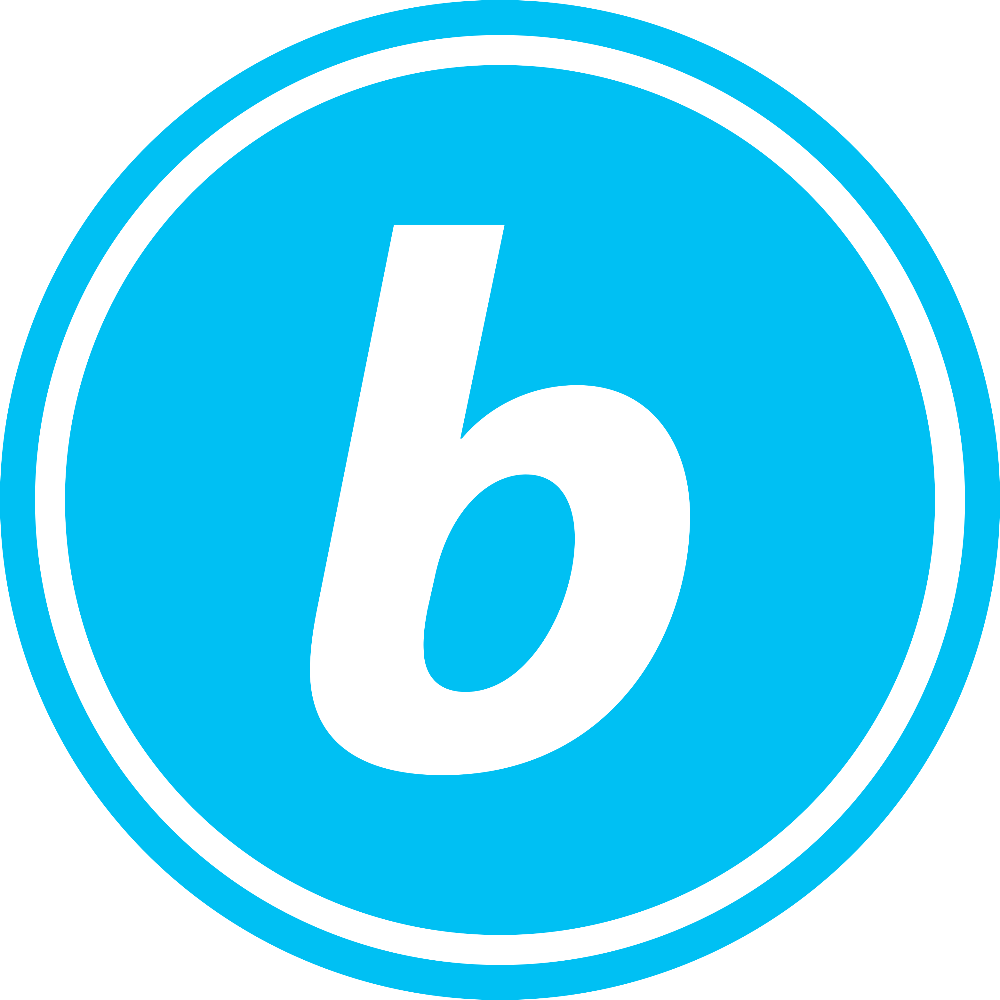

# Elementos del sistema de señalética de *b*UCR

- Una cosa
- La otra

## El logotipo ***b***

(Explicación del isotipo de *b*UCR)

La mayoría de sistemas de transporte público alrededor del mundo utiliza un símbolo para identificar el servicio en toda su comunicación.

- 
- 
- 
- 

Con base en estas referencias, proponemos un logotipo para el servicio del bus interno de la Universidad de Costa Rica, como parte de su estrategia de comunicación.

Este logotipo consiste en un círculo que engloba la letra "b", como referencia al bus.

- Utiliza el color Celeste UCR
- Utiliza la tipografía Myriad Pro, especificamente la letra ***b*** en negrita italica
- No es compatible con los logotipos de la unidades académicas, pues su utilización es de naturaleza distinta
  

## Detalles de construcción del logo

- El círculo que rodea a la letra ***b*** tiene un grosor de 1.9 cm, y esta a una distancia de 1.3 cm. Esto de acuerdo con el Manual Centroamericano de Dispositivos Uniformes para el Control de Transito.

- El tamaño de la ***b*** ocupará el espacio de 4/6, centrada en sentido vertical, medidos desde el interior de la linea de circunferencia.

- La letra ***b*** es una b minúscula en tipografía Myriad Pro, negrita.
- Áreas de respeto: El logo requiere respetar una distancia minima al rededor del mismo equivalente a al menos 1/4 del diametro del logo.

- Colores: Para el logo en su forma principal se utiliza el color blanco (#FFF) para el circulo que rodea el logo y la ***b***; y el "celeste UCR" (#00c0f3) para el fondo del mismo.

- Usos en blanco y negro: Para aplicaciones en blanco y negro o alto contraste se puede cambiar el color celeste por negro, asi logrando generar el contraste adecuado para la mayoria de las aplicaciones. 

- Alternativamente se puede usar la una version en negativo, donde el celeste se puede remplazar por blanco, y las areas blancas por negro. Esta aplicacion es especialmente util para stickers simples que ayuden a demarcar elementos especificos en las paradas. (Ver ejemplo de uso de "the T")

## Otros elementos de diseño

- Slogan