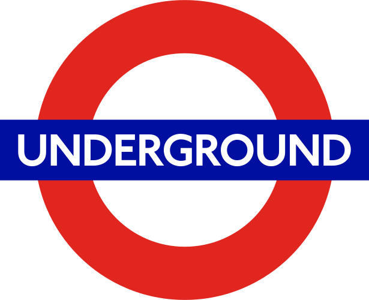
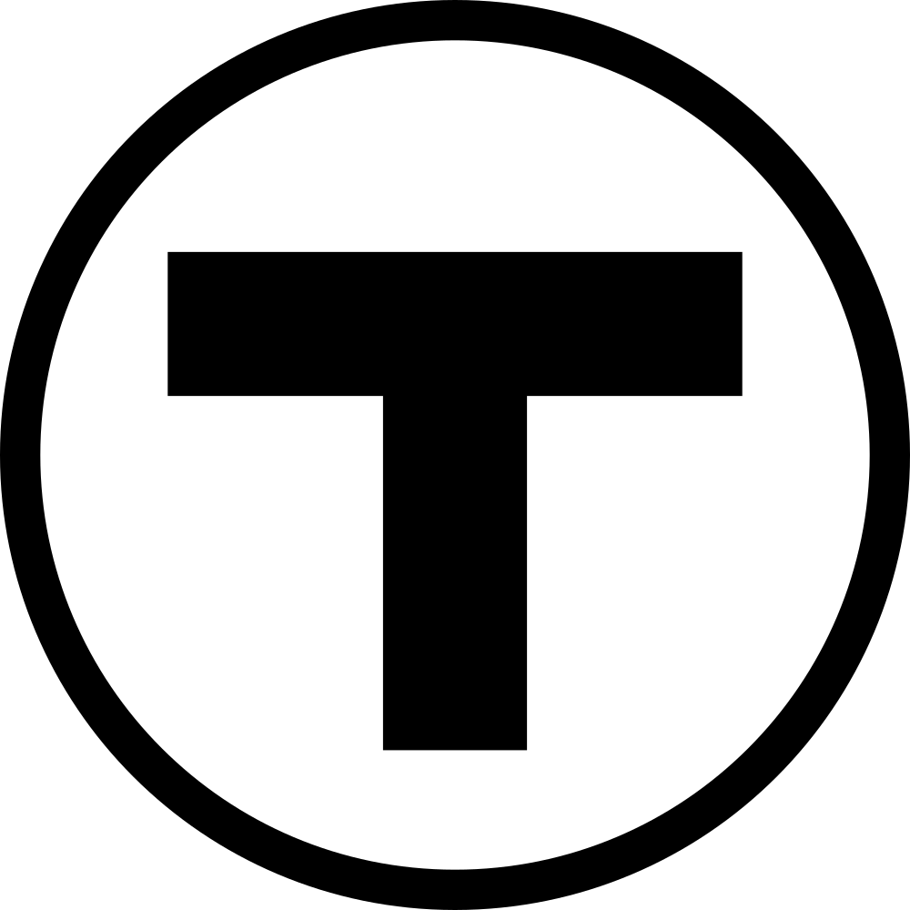

# Elementos del sistema de señalética de *b*UCR

- Una cosa
- La otra

## El logotipo ***b***

(Explicación del isotipo de *b*UCR)

La mayoría de sistemas de transporte público alrededor del mundo utiliza un símbolo para identificar el servicio en toda su comunicación.

- 
- 
- 
- 

Con base en estas referencias, proponemos un logotipo para el servicio del bus interno de la Universidad de Costa Rica, como parte de su estrategia de comunicación.

Este logotipo consiste en un círculo que engloba la letra "b", como referencia al bus.

- Utiliza el color Celeste UCR
- Utiliza la tipografía Myriad Pro
- No es compatible con los logotipos de la unidades académicas, pues su utilización es de naturaleza distinta
  

## Otros elementos de diseño
