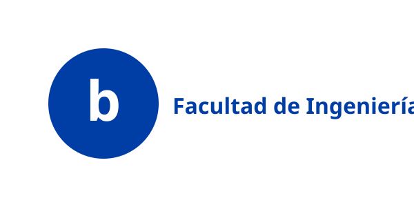
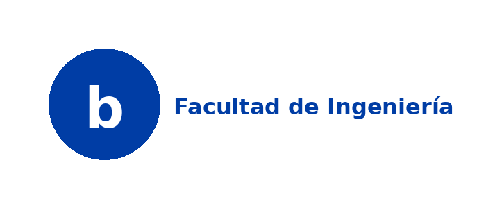
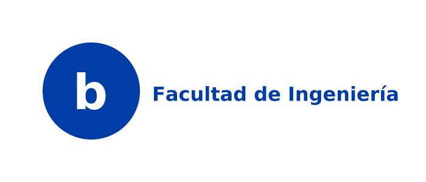
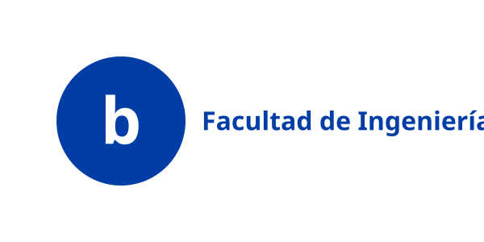

# Bibliotecas Python para Generación de Rótulos

## Objetivo

Identificar y comparar bibliotecas Python capaces de generar rótulos vectoriales con tipografía personalizada, cumpliendo con las especificaciones de diseño de bUCR.

## Requisitos del Sistema

1. **Generación de gráficos vectoriales** (SVG preferiblemente)
2. **Soporte para tipografías personalizadas** (fuentes UCR)
3. **Medición y ajuste de texto** dinámico
4. **Manejo de formas geométricas** (círculos, rectángulos, líneas)
5. **Control preciso de posicionamiento** (diseño profesional)
6. **Exportación a múltiples formatos** (SVG, PNG, PDF)

---

## Bibliotecas Candidatas

### 1. svgwrite

**Descripción:** Biblioteca pura Python para crear documentos SVG programáticamente.

**Pros:**
-  SVG nativo, formato ideal para señalética
-  Control preciso de elementos SVG
-  Soporte para fuentes web y font-family
-  Lightweight, sin dependencias pesadas
-  Documentación clara

**Contras:**
-  No renderiza, solo crea SVG. Necesita viewer externo como Inkscape
-  Medición de texto limitada, requiere cálculos y programación manual
-  No font embedding automático

**Caso de uso ideal:** Generación de SVG con especificaciones exactas conocidas de antemano.

**Ejemplo básico:** Ver [svgwrite_test.py](./examples/svgwrite_test.py)

**Resultado:** Imagen SVG con círculo azul y texto blanco centrado en dos líneas 

**Instalación:**
```bash
pip install svgwrite
```

**Veredicto:**  Excelente para SVG puro, pero requiere trabajo manual para tipografía.

---

### 2. Pillow (PIL)

**Descripción:** Biblioteca de procesamiento de imágenes raster más popular de Python.

**Pros:**
-  Muy madura y estable
-  Excelente soporte para fuentes TrueType/OpenType
-  Medición precisa de texto con `textbbox()`
-  Amplia comunidad y documentación
-  Fácil ajuste dinámico de texto

**Contras:**
-  Genera imágenes raster (PNG/JPEG), no vectoriales
-  Pérdida de calidad al escalar
-  Archivos más pesados que SVG
-  No ideal para impresión profesional

**Caso de uso ideal:** Prototipos rápidos, previews, rótulos digitales.

**Ejemplo básico:** Ver [pillow_test.py](./examples/pillow_test.py)

**Resultado:** Imagen PNG raster con círculo azul y texto



**Instalación:**
```bash
pip install Pillow
```

**Veredicto:**  Bueno para prototipado, no para producción de señalética.

---

### 3. CairoSVG + pycairo

**Descripción:** Cairo es una biblioteca de gráficos 2D con bindings Python. CairoSVG permite conversión entre formatos.

**Pros:**
-  Gráficos vectoriales de alta calidad
-  Excelente renderizado de fuentes
-  Exportación a SVG, PNG, PDF
-  Usado en producción (industria)
-  Control preciso de typography

**Contras:**
-  Dependencias del sistema (libcairo)
-  Curva de aprendizaje más alta
-  API más compleja que svgwrite
-  Setup más complicado

**Caso de uso ideal:** Generación profesional multi-formato con renderizado preciso.

**Ejemplo básico:** Ver [cairo_test.py](./examples/cairo_test.py)

**Resultado:** SVG vectorial de alta calidad con renderizado perfecto



**Instalación:**
```bash
# Dependencias del sistema (Ubuntu/Debian)
sudo apt-get install build-essential libcairo2-dev pkg-config python3-dev

# Paquete Python
pip install pycairo
```

**Veredicto:**  Mejor opción para producción profesional, a pesar de complejidad.

---

### 4. ReportLab

**Descripción:** Biblioteca comercial/open source para generación de PDF con capacidades de diagramación.

**Pros:**
-  Diseñada para documentos de producción
-  Excelente manejo de tipografía
-  Soporte para gráficos vectoriales en PDF
-  Herramientas de layout avanzadas
-  Usado en industria (facturas, reportes)

**Contras:**
-  Enfocado en PDF, no SVG
-  Licencia comercial para algunas features
-  Overhead para proyecto simple de señalética
-  Conversión PDF→SVG requiere herramientas adicionales

**Caso de uso ideal:** Documentos complejos, reportes, sistemas de impresión masiva.

**Ejemplo básico:** Ver [reportlab_test.py](./examples/reportlab_test.py)

**Resultado:** Documento PDF vectorial. El archivo generado es [reportlab_test.pdf](./examples/reportlab_test.pdf) (no mostrado directamente en markdown)

**Instalación:**
```bash
pip install reportlab

# Opcional: para conversión PDF → PNG
pip install pdf2image
sudo apt-get install poppler-utils  # dependencia de pdf2image
```

**Veredicto:**  Excelente para PDF, pero no es la mejor opción para SVG.

---

### 5. drawsvg

**Descripción:** Biblioteca moderna para crear dibujos SVG con API de alto nivel.

**Pros:**
-  API más intuitiva que svgwrite
-  Soporte para animaciones SVG
-  Renderizado en Jupyter notebooks
-  Moderna y activamente mantenida

**Contras:**
-  Comunidad más pequeña
-  Documentación menos extensa
-  Menos maduro que svgwrite

**Caso de uso ideal:** Visualizaciones interactivas, proyectos modernos.

**Ejemplo básico:** Ver [drawsvg_test.py](./examples/drawsvg_test.py)

**Resultado:** SVG con API moderna de alto nivel



**Instalación:**
```bash
pip install drawsvg
```

**Veredicto:**  Buena alternativa moderna a svgwrite.

---

## Comparativa Resumida

| Característica | svgwrite | Pillow | Cairo | ReportLab | drawsvg |
|----------------|----------|--------|-------|-----------|---------|
| **Formato nativo** | SVG | PNG | SVG/PDF/PNG | PDF | SVG |
| **Vectorial** | Si | No | Si | Si | Si |
| **Tipografía custom** | Limitado | Excelente | Excelente | Excelente | Limitado |
| **Medición texto** | Manual | Automatica | Automatica | Automatica | Manual |
| **Facilidad de uso** | Alta | Alta | Media | Media | Alta |
| **Dependencias** | Ninguna | Ninguna | libcairo | Ninguna | Ninguna |
| **Producción** | Media | Baja | Alta | Alta | Media |
| **Curva aprendizaje** | Baja | Baja | Alta | Media | Baja |

---

## Recomendación Preliminar

### Para Prototipo Rápido (MVP):
**Pillow + svgwrite**
- Usar Pillow para calcular dimensiones de texto
- Usar svgwrite para generar SVG final con medidas calculadas
- Rápido de implementar, sin dependencias del sistema

### Para Producción (Sistema Completo):
**pycairo**
- Calidad profesional
- Multi-formato (SVG/PDF/PNG)
- Manejo robusto de tipografía
- Vale la pena la curva de aprendizaje

### Alternativa Intermedia:
**drawsvg + font metrics manual**
- API moderna y limpia
- Pure Python
- Calcular métricas con fontTools si es necesario

---

## Próximos Pasos

1. ~~Identificar bibliotecas candidatas~~ (Completado)
2. ~~Crear ejemplos funcionales de cada biblioteca~~ (Completado)
3. Probar con tipografías UCR reales
4. Implementar prototipo con biblioteca seleccionada
5. Medir performance y calidad de output
6. Definir arquitectura del sistema rotulador

---

## Conclusiones

Basado en los ejemplos ejecutados y la comparativa técnica:

### Recomendación Final: **pycairo (Cairo directo)**

**Justificación:**
- Calidad profesional en renderizado vectorial
- Soporte robusto para tipografías personalizadas con Cairo directo
- Capacidad de exportar a múltiples formatos (SVG, PNG, PDF)
- Medición automática de texto con `text_extents()` - suficiente para rótulos
- Usado en producción por proyectos de gran escala
- Control preciso sobre cada elemento gráfico

**Sobre Pango:**
- **No es necesario para este proyecto** - Cairo directo es suficiente
- Ver [custom_font_pango.py](../02-typography/examples/01-font-loading/custom_font_pango.py): presenta problemas de compatibilidad
- Cairo solo puede: cargar fuentes, renderizar texto, medir dimensiones
- Multi-línea se puede hacer manualmente (ver [multiline_split.py](../02-typography/examples/03-layout/multiline_split.py))
- Pango sería útil solo para: text shaping complejo, bidirectional text, scripts complejos (overkill para rótulos simples)

**Trade-offs aceptables:**
- Requiere dependencias del sistema (libcairo)
- Curva de aprendizaje más pronunciada
- Setup inicial más complejo

**Alternativa para MVP rápido:** 
Si se necesita un prototipo inmediato sin setup de sistema, usar **svgwrite** con cálculos manuales de texto es viable para demostrar el concepto, pero migrar a Cairo para producción.

### Descartadas

- **Pillow:** No cumple requisito de vectorial
- **ReportLab:** Enfocado en PDF, no es óptimo para SVG
- **svgwrite/drawsvg:** Adecuados para prototipos, limitados para producción con tipografía compleja
- **LaTeX/TikZ:** Evaluado y descartado - overkill para este proyecto, 25-40x más lento que Cairo, dependencias pesadas (2-4 GB), curva de aprendizaje alta. Cairo ofrece calidad suficientemente profesional con mejor performance y mantenibilidad.

---

**Actualizado:** 30 de diciembre de 2025
