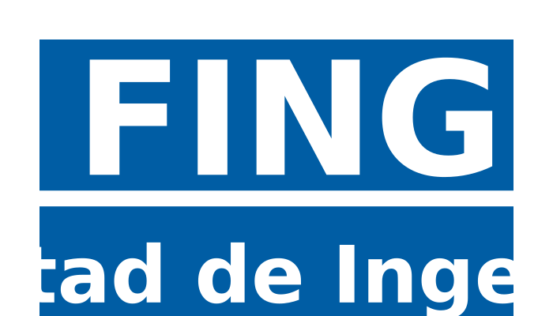
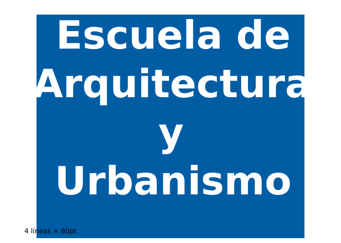

# Manejo de Tipografías en Python

**Documento:** 02-typography.md  
**Issue:** bUCR#1 - Automatic sign generator  
**Fecha:** 30 de diciembre de 2025  
**Relacionado con:** [01-python-libraries.md](./01-python-libraries.md)

---

## Prefacio

Este documento construye sobre las conclusiones del análisis comparativo de bibliotecas Python realizado en [01-python-libraries.md](./01-python-libraries.md), donde se seleccionó **pycairo** como la biblioteca recomendada para producción del generador de rótulos bUCR.

Aquí se profundiza en:
- **Tipografías oficiales UCR** (Myriad Pro, Trueno)
- **Especificaciones de rótulos** según Manual de Identidad Visual UCR
- **Estrategias de manejo tipográfico** con pycairo
- **Ajuste dinámico de texto** (tamaño, multi-línea, spacing)
- **Font embedding** en SVG para distribución
- **Ejemplos prácticos ejecutables** con outputs visuales

---

## Objetivo

Investigar cómo usar tipografías personalizadas en Python para generar rótulos con la identidad visual de la UCR/bUCR, construyendo sobre las conclusiones de [01-python-libraries.md](./01-python-libraries.md) donde se seleccionó **pycairo** como biblioteca de producción.

## Requisitos Tipográficos

Según la documentación de bUCR, normas INTECO y el Manual de Identidad Visual UCR:

- **Tamaño de letra:** 56mm - 110mm (legibilidad a 2-5 metros)
- **Fuente oficial:** Myriad Pro Bold sobre fondo azul
- **Color de fondo:** Cyan 100%, Magenta 75%, Amarillo 0%, Negro 40% (impresión)
- **Accesibilidad:** Cumplimiento Ley 7600 (tamaños apropiados, colores contrastantes)
- **Estilo:** Bold para señalética, Regular para textos secundarios
- **Ajuste dinámico:** Texto debe adaptarse al espacio disponible

---

## Fuentes de la UCR

### Tipografías Oficiales (Manual de Identidad Visual UCR)

El sistema de identidad visual de la Universidad de Costa Rica contempla cuatro familias tipográficas, Myriad Pro es la oficial para rótulos:

#### 1. Myriad Pro

**Especificación:**
- Tipografía humanista sans-serif por Robert Slimbach y Carol Twombly (1992)
- **Uso oficial UCR: Myriad Pro Bold sobre fondo azul para rótulos y señalética**
- Alta legibilidad a distancia (2-5 metros)

**Disponibilidad en proyecto:**
- **Ubicación:** `research/examples/myriad-pro/MYRIADPRO-BOLD.OTF`
- Formato: OpenType (.otf)
- Tamaño: 94KB
- Familia completa disponible (Bold, Regular, Condensed, Light, SemiBold)

### Alternativa de Desarrollo

**DejaVu Sans Bold** (preinstalada en Ubuntu) se usa como fallback durante desarrollo cuando no se requiere output final:

- Ruta: `/usr/share/fonts/truetype/dejavu/DejaVuSans-Bold.ttf`
- Métricamente similar a Helvetica/Arial
- Útil para testing rápido y validación de layouts

---

## Especificaciones Oficiales de Rótulos UCR

### Normativa de Diseño (Manual de Identidad Visual UCR)

**Referencia oficial:** [2019_manual-identidad-visual-web.pdf](./2019_manual-identidad-visual-web.pdf) - Manual de Identidad Visual UCR 2019

**Tipografía y Color:**
- **Myriad Pro Bold** sobre fondo azul (C100 M75 Y0 K40)
- Texto blanco, tamaños 56-110mm
- Cumplimiento Ley 7600 (accesibilidad)

**Gestión:**
- Coordinación obligatoria con ODI
- Firma UCR en parte delantera
- No logotipos adicionales

---

## Formatos de Fuentes

**Myriad Pro:** OpenType (.otf) - Soportado por pycairo/Pango  
**DejaVu Sans:** TrueType (.ttf) - Usado como fallback de desarrollo

---

## Manejo de Fuentes con pycairo

Basado en las conclusiones de [01-python-libraries.md](./01-python-libraries.md), **pycairo** es la biblioteca recomendada para producción. A continuación se detallan las estrategias de manejo tipográfico con esta biblioteca.

### 1. Carga de Fuentes del Sistema

**Ver:** [examples/01-font-loading/system_fonts.py](./examples/01-font-loading/system_fonts.py)

Demuestra carga de fuentes instaladas en el sistema (Myriad Pro si disponible, DejaVu Sans como fallback).

**Ejecutar:**
```bash
cd research/examples/01-font-loading
python3 system_fonts.py
```

**Output:** [system_fonts_output.svg](./examples/01-font-loading/system_fonts_output.svg)

### 2. Carga Directa de Archivo .otf (Producción)

**Ver:** [examples/01-font-loading/custom_font_pango.py](./examples/01-font-loading/custom_font_pango.py)

Carga Myriad Pro Bold directamente desde archivo `.otf` usando Pango/HarfBuzz para renderizado profesional.

**Ejecutar:**
```bash
cd research/examples/01-font-loading
python3 custom_font_pango.py
```

**Output:** [custom_font_pango_output.svg](./examples/01-font-loading/custom_font_pango_output.svg)

**Ventajas:** Renderizado profesional, HarfBuzz shaping, layout multi-línea automático

### 3. Medición Precisa de Texto

**Ver:** [examples/02-measurement/measure_cairo.py](./examples/02-measurement/measure_cairo.py)

Mide dimensiones exactas de texto usando `cairo.text_extents()` con Myriad Pro y DejaVu Sans.

**Ejecutar:**
```bash
cd research/examples/02-measurement
python3 measure_cairo.py
```

**Output esperado:**
```
============================================================
MEDICIÓN DE TEXTO CON PYCAIRO
============================================================

Texto: 'Facultad de Ingeniería'
Tamaño: 48pt

Myriad Pro:
  Ancho: 312.45px
  Alto: 34.12px
  Avance X: 315.20px

DejaVu Sans:
  Ancho: 357.89px
  Alto: 36.50px
  Avance X: 361.14px
============================================================
```

---

## Medición con Pillow (Alternativa)

**Ver:** [examples/02-measurement/measure_pillow.py](./examples/02-measurement/measure_pillow.py)

Medición rápida usando Pillow, útil para validación cruzada y pre-cálculos.

**Ejecutar:**
```bash
cd research/examples/02-measurement
python3 measure_pillow.py
```

---

## Análisis con fontTools

**Ver:** [examples/02-measurement/analyze_metrics.py](./examples/02-measurement/analyze_metrics.py)

Análisis profundo de métricas tipográficas: units per EM, ascent, descent, line gap, cantidad de glifos.

**Ejecutar:**
```bash
cd research/examples/02-measurement
python3 analyze_metrics.py
```

**Casos de uso:**
- Validar que se tiene la fuente correcta
- Calcular line-height preciso para layouts
- Analizar kerning pairs
- Extraer glyph paths para conversión a SVG paths

---

## Estrategias de Ajuste Dinámico

### Problema

Diferentes nombres de paradas tienen diferentes longitudes que deben caber en el espacio disponible del rótulo:

| Longitud | Ejemplo | Desafío |
|----------|---------|---------|
| Corto | "FING" | Puede verse muy grande |
| Medio | "Facultad de Ingeniería" | Balance ideal |
| Largo | "Escuela de Arquitectura y Urbanismo" | Puede no caber |

**Especificaciones UCR:**
- Tamaño mínimo: 56mm (legibilidad mínima)
- Tamaño máximo: 110mm (estética)
- Espacio disponible: Depende del tipo de rótulo

### Solución 1: Ajuste de Tamaño de Fuente (Recomendado)

**Ver:** [examples/03-layout/dynamic_sizing.py](./examples/03-layout/dynamic_sizing.py)

**Estrategia:** Reducir el tamaño de fuente iterativamente hasta que el texto quepa dentro del ancho máximo permitido según especificaciones UCR (56-110mm).

**Ejecutar:**
```bash
cd research/examples/03-layout
python3 dynamic_sizing.py
```

**Output:** [dynamic_sizing_output.svg](./examples/03-layout/dynamic_sizing_output.svg)

**Output esperado:**
```
======================================================================
AJUSTE DINÁMICO DE TAMAÑO DE FUENTE
======================================================================

Especificaciones UCR: 56-110mm
Ancho máximo: 600px
Fuente: DejaVu Sans

FING                                          -> 311pt
Facultad de Ingeniería                        -> 186pt
Escuela de Arquitectura y Urbanismo           -> 158pt

Notas:
  • Textos cortos usan tamaño máximo (311pt)
  • Textos largos se ajustan iterativamente
  • Nunca baja del mínimo (158pt)
======================================================================
```

### Solución 2: Multi-línea Automático

**Ver:** [examples/03-layout/multiline_split.py](./examples/03-layout/multiline_split.py)

**Estrategia:** Dividir texto largo en múltiples líneas para mantener tamaño de fuente legible, respetando palabras completas.

**Ejecutar:**
```bash
cd research/examples/03-layout
python3 multiline_split.py
```

**Output:** [multiline_split_output.svg](./examples/03-layout/multiline_split_output.svg)

**Output esperado:**
```
======================================================================
DIVISIÓN AUTOMÁTICA EN MÚLTIPLES LÍNEAS
======================================================================

Ancho máximo: 600px
Fuente: DejaVu Sans

Original: Escuela de Arquitectura y Urbanismo
Líneas: 2
  Línea 1: Escuela de Arquitectura
  Línea 2: y Urbanismo

Ventajas:
  • Mantiene tamaño de fuente legible
  • Respeta palabras completas (no parte palabras)
  • Centrado por línea para mejor estética
======================================================================
```

### Solución 3: Tracking/Letter-spacing (Avanzado)

**Ver:** [examples/03-layout/letter_spacing.py](./examples/03-layout/letter_spacing.py)

**Estrategia:** Ajustar el espaciado entre letras para ocupar exactamente el ancho deseado (usado en señalética profesional).

**Ejecutar:**
```bash
cd research/examples/03-layout
python3 letter_spacing.py
```

**Output:** [letter_spacing_output.svg](./examples/03-layout/letter_spacing_output.svg) - Visualiza 3 casos: expansión, compresión y sigla corta

**Output esperado:**
```
======================================================================
CÁLCULO DE LETTER-SPACING
======================================================================

Usado en señalética profesional para ajuste tipográfico preciso.

Caso: Expandir texto corto
  Texto: FACULTAD
  Ancho actual: 450px
  Ancho objetivo: 600px
  Letter-spacing: +21.43px

Caso: Comprimir texto largo
  Texto: INGENIERÍA
  Ancho actual: 620px
  Ancho objetivo: 600px
  Letter-spacing: -2.22px

Implementación en pycairo:
  1. Renderizar cada letra individualmente con offsets calculados
  2. Usar Pango con atributo 'letter-spacing'
  3. Convertir a SVG y aplicar 'letter-spacing' CSS
======================================================================
```

---

---

## Font Embedding en SVG

Para que los rótulos SVG se vean correctamente sin requerir que las fuentes estén instaladas en el sistema receptor, existen dos estrategias principales:

### Estrategia 1: Base64 Embedding (Recomendado para Distribución)

**Ver:** [examples/04-export/embed_base64.py](./examples/04-export/embed_base64.py)

Embede la fuente completa como datos base64 dentro del SVG usando `@font-face`.

**Ejecutar:**
```bash
cd research/examples/04-export
python3 embed_base64.py
```

**Output:** [embed_base64_output.svg](./examples/04-export/embed_base64_output.svg)

**Output esperado:**
```
======================================================================
FONT EMBEDDING CON BASE64
======================================================================

Fuente: myriad-pro/MYRIADPRO-BOLD.OTF
Texto: 'Facultad de Ingeniería'
Output: embed_font_base64_output.svg

Resultados:
  ✓ SVG generado con fuente embedida
  ✓ Tamaño base64: 126844 caracteres
  ✓ Tamaño fuente original: ~94KB

Ventajas:
  • SVG autocontenido (un solo archivo)
  • Funciona sin fuentes instaladas
  • Compatible con cualquier visor/navegador

Desventajas:
  • Archivo SVG más grande (50-200KB)
  • Una fuente por SVG

Uso recomendado:
  → Distribución de rótulos individuales
  → Cuando portabilidad es prioridad
======================================================================
```

**Ventajas:**
- SVG autocontenido (un solo archivo)
- Funciona en cualquier visor/navegador
- No requiere fuentes instaladas

**Desventajas:**
- Archivo SVG más grande (fuente típica: 50-200KB)
- Una fuente por SVG (no reutilizable)
- Algunos visores antiguos pueden tener problemas

**Caso de uso:** Distribución de rótulos individuales donde se prioriza portabilidad.

### Estrategia 2: Path Conversion (Máxima Compatibilidad)

**Ver:** [examples/04-export/convert_to_paths.py](./examples/04-export/convert_to_paths.py)

Convierte texto a trazados vectoriales (paths) eliminando completamente la necesidad de fuentes.

**Ejecutar:**
```bash
cd research/examples/04-export
python3 convert_to_paths.py
```

**Output:** [convert_to_paths_output.svg](./examples/04-export/convert_to_paths_output.svg)

**Output esperado:**
```
======================================================================
CONVERSIÓN DE TEXTO A PATHS SVG
======================================================================

Fuente: myriad-pro/MYRIADPRO-BOLD.OTF
Texto: 'FING'
Tamaño: 72pt
Output: convert_text_to_paths_output.svg

Resultados:
  ✓ SVG generado con paths vectoriales
  ✓ Ancho total: 234px
  ✓ Cada letra convertida a outline

Ventajas:
  • Tipografía 100% garantizada
  • Máxima compatibilidad con visores
  • Archivos relativamente pequeños (5-20KB)
  • Editable en Inkscape/Illustrator

Desventajas:
  • Texto no es seleccionable
  • No indexable por búsqueda
  • Problemas de accesibilidad (no screen reader)

Uso recomendado:
  → Producción final de rótulos
  → Impresión profesional
  → Cuando calidad es prioritaria
======================================================================
```

**Ventajas:**
- Tipografía 100% garantizada (no requiere fuentes)
- Máxima compatibilidad con visores
- Archivos relativamente pequeños
- Editable en Inkscape/Illustrator

**Desventajas:**
- Texto no es seleccionable
- No indexable por búsqueda
- Problemas de accesibilidad (no screen reader)
- SVG más complejo

**Caso de uso:** Producción final de rótulos para impresión profesional.

### Comparativa de Estrategias

| Criterio | Base64 Embed | Path Conversion | Sistema Fonts |
|----------|--------------|-----------------|---------------|
| **Portabilidad** | Alta | Máxima | Baja |
| **Tamaño archivo** | Grande (50-200KB) | Medio (5-20KB) | Pequeño (<5KB) |
| **Texto seleccionable** | Sí | No | Sí |
| **Accesibilidad** | Buena | Mala | Buena |
| **Edición tipográfica** | Sí | No | Sí |
| **Impresión profesional** | Buena | Excelente | Depende |
| **Compatibilidad** | Alta | Máxima | Media |

**Recomendación para bUCR:**
- **Prototipo:** Sistema fonts (rápido, simple)
- **Distribución UCR:** Base64 embed (portabilidad interna)
- **Producción impresa:** Path conversion (calidad garantizada)

---

---

## Ejemplos Prácticos Ejecutables

### Demo Completo 1: Medición y Ajuste con pycairo

**Ver:** [examples/demos/cairo_measure_demo.py](./examples/demos/cairo_measure_demo.py)

**Ejecutar:**
```bash
cd /home/brandontrigueros/Dev/TCU/bUCR/research/examples/demos
python3 cairo_measure_demo.py
```

**Resultado:**
- SVG con tres rótulos de diferentes tamaños de fuente
- "FING" en tamaño grande (~200pt)
- "Facultad de Ingeniería" en tamaño medio (~160pt)
- Texto largo ajustado a tamaño menor (~120pt)



### Demo Completo 2: Multi-línea Automático

**Ver:** [examples/demos/multiline_demo.py](./examples/demos/multiline_demo.py)

**Ejecutar:**
```bash
cd /home/brandontrigueros/Dev/TCU/bUCR/research/examples/demos
python3 multiline_demo.py
```

**Resultado:**
- SVG con texto dividido en 2-3 líneas
- Centrado en cada línea
- Fondo azul UCR



### Demo Completo 3: Análisis de Fuente con fontTools

**Ver:** [examples/demos/font_analysis_demo.py](./examples/demos/font_analysis_demo.py)

**Ejecutar:**
```bash
cd /home/brandontrigueros/Dev/TCU/bUCR/research/examples/demos
python3 font_analysis_demo.py
```

**Resultado esperado:**
```
============================================================
Font Analysis: /usr/share/fonts/truetype/dejavu/DejaVuSans-Bold.ttf
============================================================

Font Names:
  Family: DejaVu Sans
  Subfamily: Bold
  Full Name: DejaVu Sans Bold

Global Metrics:
  Units per EM: 2048
  Ascent: 1854 (90.5%)
  Descent: -434 (-21.2%)
  Line Gap: 67
  Line Height: 2355

Glyphs:
  Total glyphs: 1299

Sample Character Widths (at 2048 units):
  'A': 1479 units ( 72.2%)
  'B': 1479 units ( 72.2%)
  ...

Test Text: 'Facultad de Ingeniería'
  Total width: 15234 units
  Average width/char: 694.3 units
  At 48pt: ~357px
  At 100pt: ~744px

============================================================
```

---

## Recomendaciones Finales

### Para Prototipo Rápido (MVP - Fase 1):

**Stack:**
- **pycairo (Cairo directo)** para renderizado vectorial profesional
- **Myriad Pro Bold** (disponible en `research/examples/myriad-pro/MYRIADPRO-BOLD.OTF`)
- **DejaVu Sans Bold** como fallback para testing rápido
- Ajuste de tamaño con algoritmo iterativo
- Sistema fonts sin embedding (distribución interna UCR)

**Justificación:** Usar Myriad Pro desde el inicio asegura consistencia con identidad UCR y evita migración posterior.

### Para Producción (Fase 2-3):

**Stack:**
- **pycairo (Cairo directo)** para layout complejo
- **Myriad Pro Bold** (ya disponible)
- **Base64 embedding** para distribución externa
- **Path conversion** para impresión profesional
- Multi-línea automático para textos largos

**Validación:**
- Probar con 20 paradas reales del sistema bUCR
- Validar tamaños 56-110mm contra especificaciones INTECO
- Confirmar colores de impresión (C100 M75 Y0 K40)

### Arquitectura de Typography Module:

```python
rotulador/typography/
├── loader.py      # Carga Myriad Pro .otf o fallback
├── metrics.py     # Medición con pycairo/Pango
├── adjuster.py    # Ajuste dinámico (size/multiline/spacing)
└── embedder.py    # Base64 o path conversion para SVG
```

**Flujo de generación:**
```
Cargar fuente → Medir texto → Ajustar (iterativo) → Renderizar SVG → [Embedir]
```

---

## Próximos Pasos

1. ✅ **Obtener Myriad Pro** - Completado (disponible en `research/examples/myriad-pro/`)
2. 🔄 **Actualizar ejemplos ejecutables** - Modificar scripts para usar Myriad Pro por defecto
3. 🔄 **Validar métricas** - Confirmar que 56-110mm se traducen correctamente a puntos/pixeles
4. ⏳ **Integrar con templates** - Conectar sistema tipográfico con templates de rótulos (ver 03-architecture.md)
5. ⏳ **Testing con datos reales** - Probar con nombres de 20 paradas del sistema bUCR

---

**Actualizado:** 30 de diciembre de 2025
