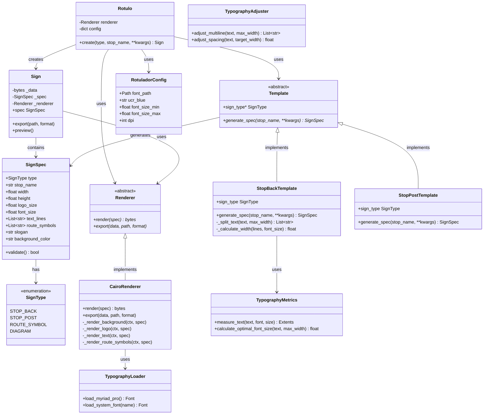
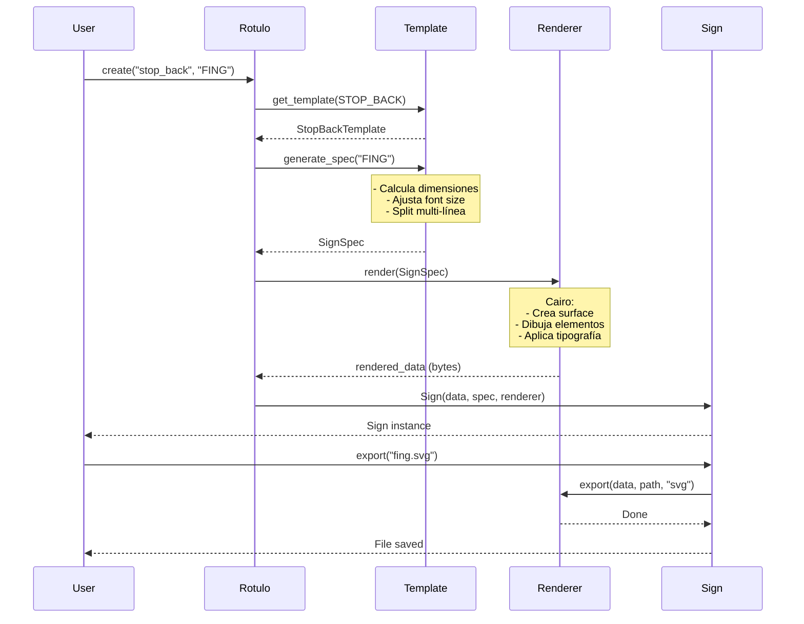
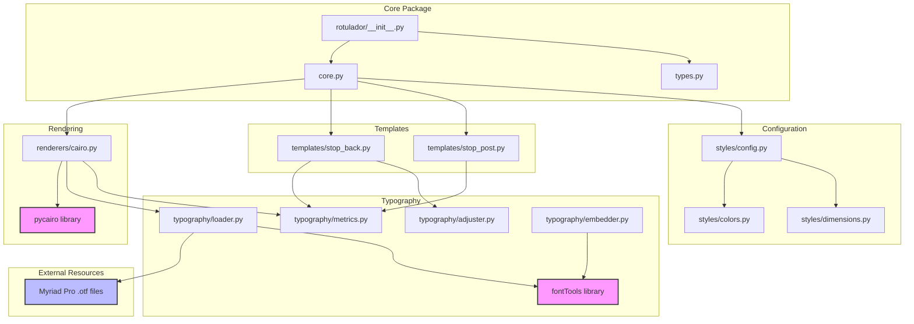
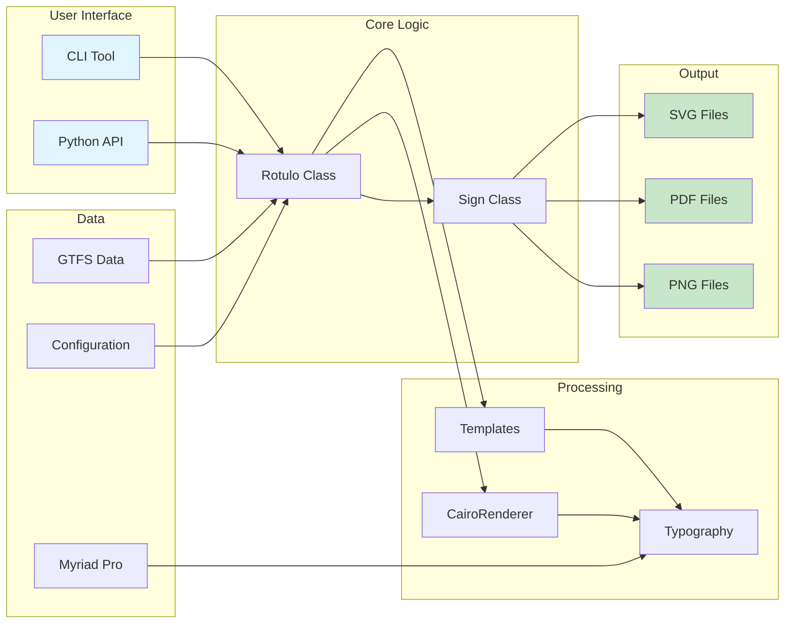
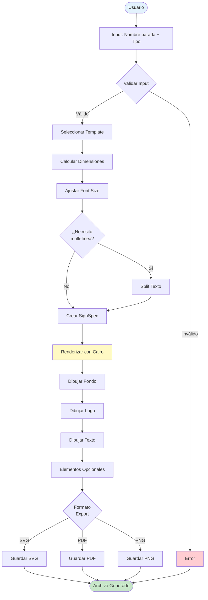

# Diagramas de Arquitectura - Rotulador

Este archivo contiene los diagramas en formato Mermaid para generar imágenes.

## Instrucciones de Generación

Puedes generar las imágenes de estos diagramas usando:
- **Mermaid Live Editor:** https://mermaid.live/
- **CLI:** `mmdc -i diagrams.md -o diagrams.png`
- **VS Code:** Extensión "Markdown Preview Mermaid Support"

---

## 1. Diagrama de Clases Completo



---

## 2. Diagrama de Secuencia - Flujo de Generación



---

## 3. Diagrama de Dependencias del Paquete



---

## 4. Arquitectura del Sistema Completo



---

## 5. Flujo de Datos Simplificado



---

## Notas de Implementación

### Colores en Diagramas
- 🟪 Dependencias externas (bibliotecas)
- 🟦 Recursos externos (fuentes)
- ⬜ Módulos internos
- 🟩 Outputs/resultados
- 🟨 Procesamiento crítico

### Generación de Imágenes

**Opción 1: Mermaid Live Editor**
1. Copiar código del diagrama
2. Ir a https://mermaid.live/
3. Pegar y exportar como PNG/SVG

**Opción 2: CLI (si tienes mermaid-cli)**
```bash
npm install -g @mermaid-js/mermaid-cli
mmdc -i diagrams.md -o class-diagram.png -t dark
```

**Opción 3: VS Code**
1. Instalar extensión "Markdown Preview Mermaid Support"
2. Abrir este archivo
3. Vista previa (Ctrl+Shift+V)
4. Click derecho → "Copy Mermaid as PNG"

---

**Actualizado:** 30 de diciembre de 2025
