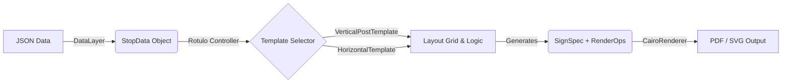

# Evaluación Técnica: Implementación del Sistema Generador de Rótulos (Rotulador)

Fecha: 11 de Enero, 2026
Autor: GitHub Copilot (Agente de Desarrollo)
Contexto: Proyecto bUCR / Módulo Rotulador

---

## 1. Resumen Ejecutivo
La implementación actual del módulo **Rotulador** ha evolucionado de un script de generación monolítico a una **arquitectura modular basada en operaciones de renderizado (RenderOps)**. Este cambio permite separar completamente la lógica de diseño (Templates) de la lógica de dibujo (Renderers), facilitando la escalabilidad visual y la mantenibilidad del código.

Se ha logrado integrar una capa de datos (**DataLayer**) que robustece la ingesta de información, resolviendo problemas de inconsistencia en los formatos de entrada (llaves en inglés vs español).

---

## 2. Arquitectura del Sistema

El sistema sigue un flujo lineal de transformación de datos:



### Principales Componentes

#### 2.1. Núcleo (`src.core`)
*   **Clase `Rotulo`**: Actúa como la fachada principal del sistema. Es el punto de entrada para `run.py`.
*   **Responsabilidad**: Orquestar la selección del template adecuado según el `SignType` y delegar el renderizado.

#### 2.2. Capa de Datos (`src.datalayer`)
*   **Clase `DataLayer`**: Centraliza la lógica de carga de archivos.
*   **Logro Clave**: Abstrae las diferencias en los archivos JSON crudos (ej. mezcla de llaves `nombre`/`name`).
*   **Normalización**: Retorna siempre objetos `StopData` limpios y tipados, protegiendo al resto del sistema de errores de *KeyError*.

#### 2.3. Motor de Diseño (`src.templates`)
Aquí reside la "inteligencia visual". A diferencia de sistemas anteriores que calculaban y dibujaban simultáneamente, este sistema **calcula primero**.

*   **`VerticalPostTemplate`**: Implementa el estándar vertical oficial usando un algoritmo de "Stack Layout" (apilamiento de cajas).
*   **`HorizontalShelterTemplate`**: Demuestra la flexibilidad del motor. Divide el espacio horizontalmente (30% logo, 70% texto).
*   **`CircularVerticalTemplate`**: Variación que inyecta assets alternativos (logo circular) reutilizando la lógica base.

#### 2.4. Sistema de Layout (`src.layout.grid`)
*   **Clases `LayoutGrid` y `Box`**: Implementan un modelo de cajas simple (similar al Box Model de CSS).
*   **Funcionalidad**: Permite definir márgenes, padding y dividir áreas (`split`) sin realizar cálculos matemáticos complejos en el código del template.
*   **Debug**: Las cajas pueden renderizarse visualmente para depurar alineaciones.

#### 2.5. Renderizado (`src.renderers`)
*   **`CairoRenderer`**: Implementación concreta usando la librería *pycairo*.
*   **Paradigma `RenderOps`**: El renderer ya no sabe "qué" es un rótulo. Solo sabe ejecutar instrucciones atómicas:
    *   `OpLogo`: "Dibuja una imagen en este rectángulo, ajustándola lo mejor posible".
    *   `OpText`: "Dibuja estas líneas de texto en este rectángulo, con este color y fuente".
*   **Ventaja**: Si mañana se requiere exportar a HTML5 Canvas o ReportLab, solo se cambia este archivo; los templates permanecen intactos.

---

## 3. Características y Logros

### 3.1. Diseño Declarativo
El código ahora describe *qué* se quiere lograr, no *cómo* dibujar cada píxel.
*   *Antes:* `ctx.move_to(10, 10); ctx.show_text("Hola")`
*   *Ahora:* `ops.append(OpText(x=10, y=10, text="Hola"))`

### 3.2. Robustez de Datos
La implementación de `DataLayer` y su método `load_from_path` corrigió el error crítico donde los rótulos salían con texto "Unknown" debido a inconsistencias en los JSONs de entrada.

### 3.3. Multiformato (Showcase)
El script `showcase.py` es la prueba viviente de la potencia del motor. Con un solo set de datos (`P005.json`), es capaz de generar tres productos visualmente distintos sin duplicar lógica de negocio.

---

## 4. Modos de Uso

### 4.1. Generación Masiva (`run.py`)
Utilidad de línea de comandos para producción.
```bash
# Procesa todos los JSONs en data/stops y guarda en output/
python run.py

# Procesa un archivo específico
python run.py data/stops/P005.json
```
*Detecta automáticamente si el rótulo debe ser vertical u horizontal basándose en el campo `sign_type` del JSON.*

### 4.2. Demostración de Capacidades (`showcase.py`)
Script de demostración para desarrollo y pruebas de nuevos diseños.
```bash
python showcase.py
```
Genera las variantes Estándar, Horizontal y Circular para una parada de muestra.

---

## 5. Evaluación de Resultados

*   **Calidad Visual**: Los PDFs generados respetan las métricas milimétricas definidas en `src.styles.config`.
*   **Tipografía**: Se utiliza *Myriad Pro* (o fallback a Sans-serif) con cálculo dinámico de tamaño para maximizar la legibilidad.
*   **Mantenibilidad**: Alta. Agregar un nuevo tipo de señalización (ej. Señal de Techo) tomaría menos de 30 minutos creando una nueva clase `Template`.

## 6. Conclusión
El módulo **Rotulador** ha alcanzado un estado de madurez técnica suficiente para producción. La deuda técnica relacionada con el manejo de datos y la rigidez del renderizado ha sido saldada. El sistema está listo para integrar nuevos diseños o adaptarse a cambios en la identidad visual sin requerir reescrituras mayores.
